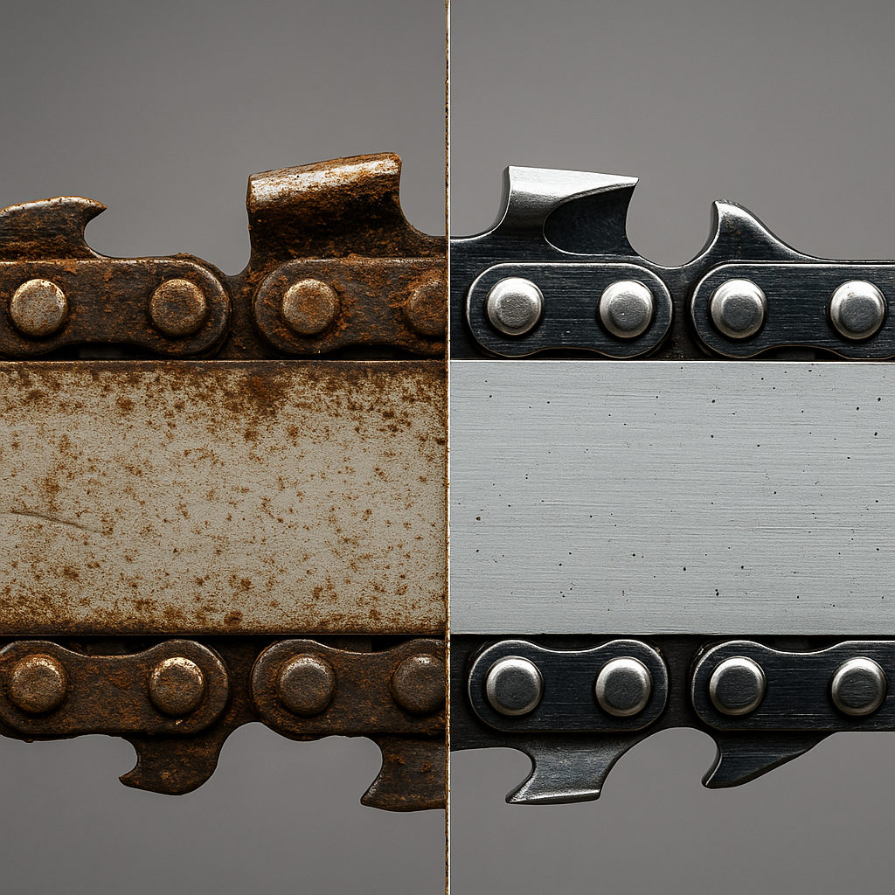

**A dull saw is dangerous. So is a burned-out team member.**

A tree came down in my back yard, so I broke out my chainsaw.

For a while, everything went smoothly. But after a couple of hours, the saw started binding. The cuts were slow. The work became difficult. The tool wasn’t broken. The chain was just dull.

So I took a break. Recharged the batteries (the saw is electric). Sharpened the chain. When I returned to work, my saw was chewing through the wood easily again.

People are the same. We cut through our hard work easily for a time. But if we keep pushing, our batteries drain, our abilities dull, and we become ineffective. The work is more difficult.

Too often we push past fatigue, trying to prove we can “power through.” But just like a dull saw, a tired, burned-out human becomes less effective and more likely to cause damage.

As leaders, it’s on us to set the tone.
Taking breaks isn’t a weakness. It’s maintenance.
Rest isn’t wasted time. It’s what makes the next effort productive.

If we don’t sharpen and recharge, we wear ourselves — and our teams — down.

👉 Check-in time: **Are you modeling recovery, or modeling burnout?**

