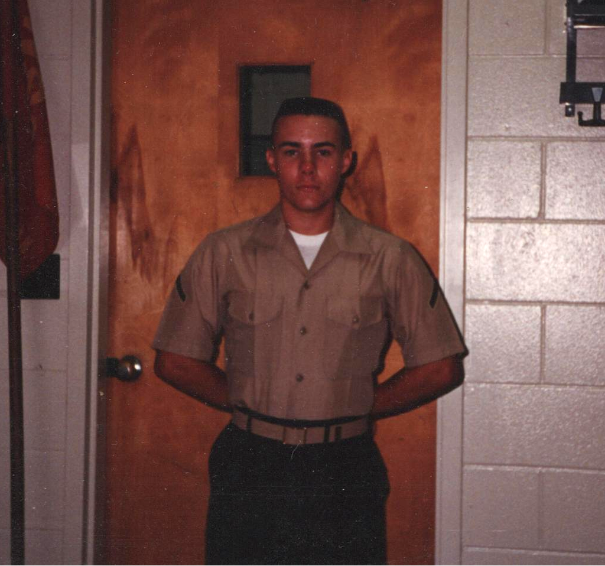

A piece of wisdom from my military days: The more you **sweat** in training, the less you **bleed** in combat.

From the moment I hit Parris Island, Marine drill instructors insisted on one thing above all else: always give 110%.

As fresh recruits, our natural tendency was to give about 50% effort to our training. Maybe 75% to show off. But that was never good enough.

Over and over it was drilled into us: the way you behave in training is the way you will behave in combat.

You *think* that when the bullets are real, you will naturally step up your game. But that's wrong.

In the heat of combat, you don't have time to think before you react. Your body will work on pure muscle memory. If you have trained it to hold back, or to move slow, that's exactly what will happen.

We were taught to train as if our lives were at stake. Because one day, they would be. And we had to be ready.

Are you holding back when you should be giving your all?

Photo: Archival photo of Private First Class Veselosky, in Class C uniform, circa 1989.

