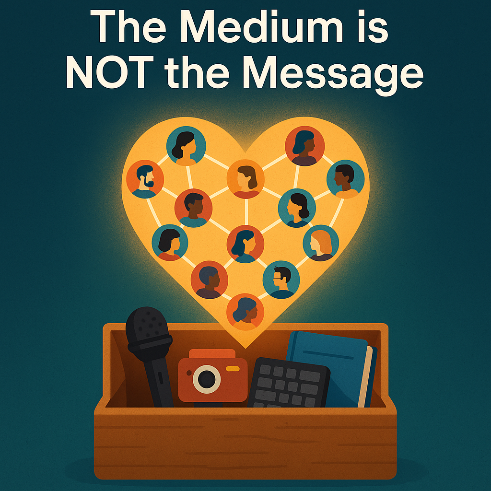

The Medium is NOT the message.

Here’s why today’s internet creators build communities, not channels.

In the old media business, the **channel was everything.**  
📺 TV and radio had a specific frequency to broadcast on.  
📰 Newspapers ran giant printing presses to deliver paper to your door daily.  
📖 Magazines shipped glossy pages held together with glue and staples.  

Each business stuck to its medium, and treated it like a product.  

The new media business is run by creators who:  
✍️ Write newsletters  
🎙 Record podcasts  
🎥 Produce video  
📚 Publish ebooks  
📓 Teach online courses  

They aren’t producing a single product in a single medium.  
They’re connecting with their audience, in multiple ways, at multiple times.  

That connection—**the community**—is the real value of the business.  
You provide value to them. They support you in return.  

Mediums change. Platforms change. Technology changes.  
But community lasts. Build that.  

